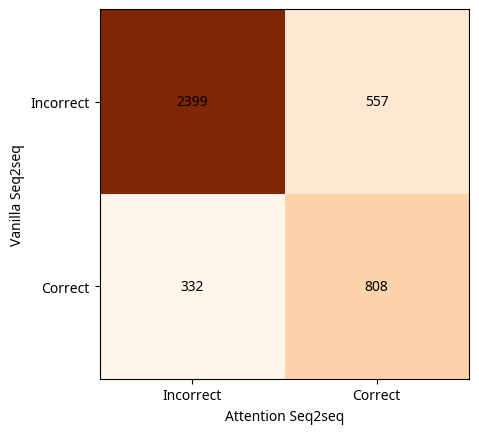

# Introduction

This is an implementation of the Encoder-Decoder architecture used to solve a transliteration problem: Converting English words to Hindi words. 
For example, the word 'ghar' would be transliterated to 'घर'.

There are two different implementations to solve the same problem:
- one without using attention and instead using a RNN based architecture
- one using attention for the same RNN based architecture

# Running the code

The barebones code is in `train.py`. Inside, you will find code comments on the architecture and the hyperparameters used.
The code can be run using the following command:

```
python train.py
```
The appropriate arguments can be added using the `--help` argument.

The actual results of running the code are in `a3.ipynb`. This is where you would find the sweeps.

# Results

The predictions of both the implementations are in the `predictions_vanilla` and the `predictions_attention` folder. There, you would find the predictions with and without attention. 

## Vanilla Seq2seq

While these results are found for 5 epochs, we shall be checking them against 10 epochs for the test set.

The training and the validation accuracy for the best model after 10 epochs were 37.0% and 30.7% respectively. The test validation accuracy was 27.8%. 


## Seq2seq with attention

The best model was taken and tested on the test set. The model was trained for 10 epochs in the case. The validation accuracy was 36.1% and the training accuracy was 39.5%. This is better than the vanilla model but not by a lot. 

We can show some heatmaps for the attention matrices computed by the model for some sample words.


# Comparing the vanilla seq2seq with the seq2seq with attention

The attention model is better than the vanilla model by their validation accuracies. We can compare the models also by looking at their correct and incorrect words. The results are shown below:


The attention model does get some words right that the vanilla model does not. However, the vanilla model also gets some words right that the attention model does not (around 8 percent).

